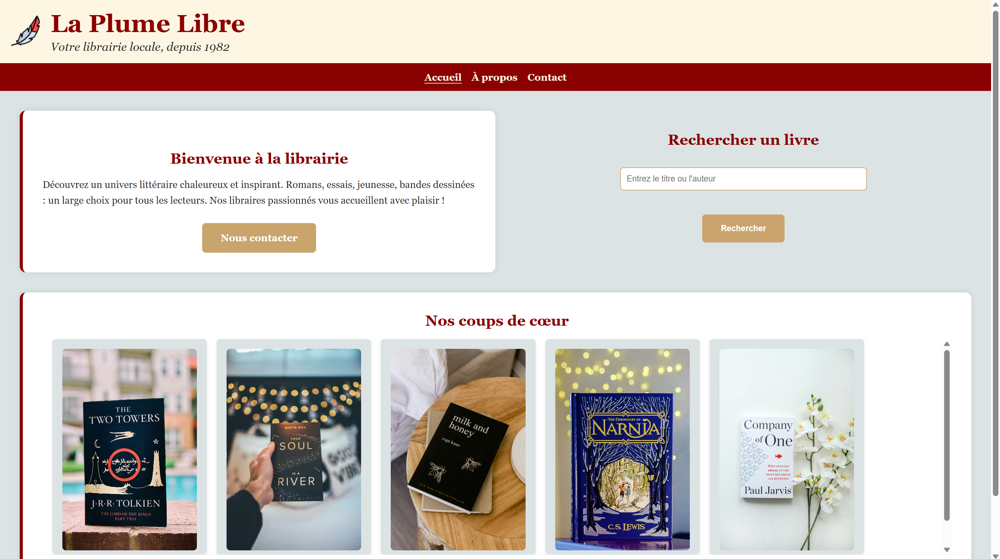

# 📚 La Plume Libre

Bienvenue sur le dépôt du site **La Plume Libre**, une librairie locale indépendante fondée en 1982. 
Ce site vitrine présente l’univers de la librairie, ses coups de cœur littéraires, son équipe passionnée et propose un formulaire de contact pour les visiteurs.

---

## 🌐 Aperçu

Aperçu page d'accueil
 <!-- Ajoute une capture réelle si disponible -->

---

## 🧱 Structure du projet

```bash
/la-plume-libre
├── index.html                # Page d’accueil
├── about.html                # Page "À propos"
├── contact.html              # Page de contact
├── css/
│   └── style.css             # Feuille de style principale
├── js/
│   └── script.js             # Script JavaScript (menu responsive, interactions)
├── img/
│   ├── icon/                 # Icônes (ex. logo)
│   └── ...                   # Couvertures de livres (coups de cœur)
└── README.md                 # Ce fichier
